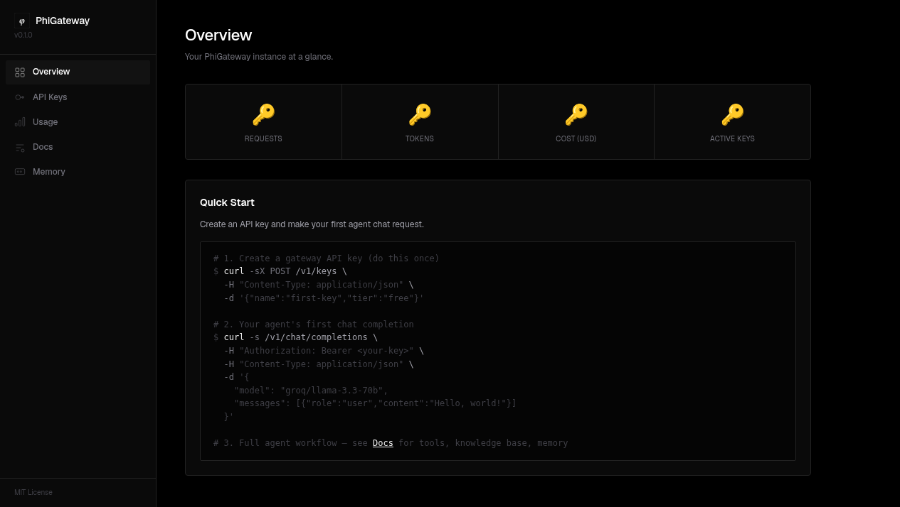

<h1 align="center">Phi Gateway</h1>

<p align="center">
  <em>Self-hosted AI gateway — LLM proxy, tool registry, RAG knowledge base, and agent memory behind one API.</em>
</p>

<p align="center">
  <a href="https://github.com/raindragon14/phi-gateway/actions"></a>
  <a href="https://www.python.org/downloads/"></a>
  <a href="https://pypi.org/project/phi-gateway/"></a>
  <a href="https://github.com/raindragon14/phi-gateway/blob/main/LICENSE"></a>
  <a href="https://hub.docker.com/r/raindragon14/phi-gateway"></a>
</p>

---

**Docker up in under a minute. Zero SaaS lock-in.** Route LLM requests to any provider, register tools via MCP, search a built-in knowledge base, and track agent memory — all through a single OpenAI-compatible endpoint.

```bash
pip install phi-gateway
# or: docker compose up -d
```

```python
from openai import OpenAI

client = OpenAI(base_url="http://localhost:8000/v1", api_key="phi-sk-...")
response = client.chat.completions.create(
    model="groq/llama-3.3-70b",
    messages=[{"role": "user", "content": "Summarize my last conversation"}],
)
# Routes to Groq, searches memory, returns answer + logs cost
```

<p align="center">
  <a href="#what-is-phigateway">What is it?</a> ·
  <a href="#quick-start">Quick Start</a> ·
  <a href="#features">Features</a> ·
  <a href="#screenshots">Screenshots</a> ·
  <a href="#roadmap">Roadmap</a> ·
  <a href="CONTRIBUTING.md">Contributing</a>
</p>

---

## What is PhiGateway?

Every AI agent needs an LLM, tools, knowledge, and memory. PhiGateway puts all four behind **one OpenAI-compatible endpoint**:

| Primitive | What it does | Why it matters |
|-----------|-------------|----------------|
| **LLM Proxy** | Route chat to OpenAI / Anthropic / Groq / OpenRouter. Streaming, cost tracking, logging. | Switch providers, free tiers, fallback — without changing agent code. |
| **Tool Registry** | Register tools with JSON Schema. Agents discover + call via REST or MCP (JSON-RPC 2.0). | One registry for every tool. MCP-native, compatible with any MCP client. |
| **Knowledge Base** | Chunk, embed, and search documents. Cosine similarity + keyword fallback. No external vector DB. | Ship a knowledge base inside a single SQLite file. Zero ops, zero new infra. |
| **Agent Memory** | Store conversations, paginate history, auto-trim context. Returns `X-Context-Truncated` header. | Agent remembers past turns. Trimming keeps token costs under control. |

## Quick Start

```bash
git clone https://github.com/raindragon14/phi-gateway
cd phi-gateway
cp .env.example .env    # add your LLM provider keys
docker compose up -d
```

Gateway starts on port 8000. Create a key and make your first request:

```bash
# 1. Create a gateway API key
curl -sX POST http://localhost:8000/v1/keys \
  -H "Content-Type: application/json" \
  -d '{"name":"my-agent","tier":"free"}'
# → {"key": "phi-sk-...", ...}

# 2. Chat through the gateway
curl -s http://localhost:8000/v1/chat/completions \
  -H "Authorization: Bearer phi-sk-..." \
  -H "Content-Type: application/json" \
  -d '{"model":"groq/llama-3.3-70b","messages":[{"role":"user","content":"Hello"}]}'
```

**Live instance:** <https://phiconsulting.biz.id> — the same gateway, deployed with Caddy + Docker.

## Screenshots

| Interactive API Reference (Scalar) | Admin Dashboard (HTMX) |
|:-:|:-:|
|  |  |

## Features

### LLM Proxy

Single endpoint (`/v1/chat/completions`) routes to multiple providers. Model string determines the backend — your agent code never changes. Streaming (SSE) and cost tracking included.

| Model | Provider | Context | Pricing (in/out per 1M) |
|-------|----------|---------|-------------------------|
| `gpt-5-nano` | OpenAI | 400k | $0.05/$0.40 |
| `gpt-5-mini` | OpenAI | 400k | $0.25/$2.00 |
| `gpt-5.2` | OpenAI | 400k | $1.75/$14.00 |
| `gpt-4.1` | OpenAI | 1M | $2.00/$8.00 |
| `gpt-4.1-nano` | OpenAI | 1M | $0.10/$0.40 |
| `claude-haiku-4.5` | Anthropic | 200k | $1.00/$5.00 |
| `claude-sonnet-4.6` | Anthropic | 200k | $3.00/$15.00 |
| `claude-opus-4.6` | Anthropic | 200k | $5.00/$25.00 |
| `groq/llama-3.3-70b` | Groq | 128k | free |
| `groq/llama-4-scout` | Groq | 128k | free |
| `groq/deepseek-r1-distill-llama-70b` | Groq | 128k | free |
| `openrouter/google/gemini-2.5-flash` | OpenRouter | 1M | $0.15/$0.60 |
| `openrouter/deepseek/deepseek-r1` | OpenRouter | 128k | $0.55/$2.19 |
| `openrouter/mistralai/mistral-medium-3-5` | OpenRouter | 256k | $2.00/$6.00 |
| `openrouter/poolside/laguna-m.1:free` | OpenRouter | 128k | free |

Full model list available at `/v1/models`. Supports provider filtering (`?provider=groq`) and search (`?q=llama`).

### Tool Registry (MCP-native)

Register external capabilities with JSON Schema contracts. The gateway validates inputs and proxies executions. Supports both REST and MCP (JSON-RPC 2.0).

```bash
# Register a tool
curl -sX POST http://localhost:8000/v1/tools \
  -H "Authorization: Bearer phi-sk-..." \
  -H "Content-Type: application/json" \
  -d '{"name":"search","description":"Web search","json_schema":{...},"endpoint":"https://..."}'

# Discover via MCP
curl -sX POST http://localhost:8000/mcp \
  -H "Authorization: Bearer phi-sk-..." \
  -H "Content-Type: application/json" \
  -d '{"jsonrpc":"2.0","method":"tools/list","id":"1"}'
```

### Knowledge Base

Paragraph-aware chunking, embeddings via OpenAI, cosine similarity search. Falls back to keyword search when embeddings are unavailable. Everything in SQLite — no external vector DB.

```bash
# Create a knowledge base
curl -sX POST http://localhost:8000/v1/kb \
  -H "Authorization: Bearer phi-sk-..." \
  -H "Content-Type: application/json" \
  -d '{"name":"product-docs"}'

# Search it
curl -sX POST http://localhost:8000/v1/kb/{id}/search \
  -H "Authorization: Bearer phi-sk-..." \
  -H "Content-Type: application/json" \
  -d '{"query":"deployment guide","top_k":5}'
```

### Agent Memory

Full CRUD for conversations with pagination and context window management. Auto-trims oldest messages when token count exceeds the model's context limit, returning `X-Context-Truncated`.

## Use Cases

**Internal AI Assistant** — Deploy behind your VPN. Give your team a company-wide AI agent with access to internal docs, codebases, and tools — no data sent to third-party gateways.

**Customer Support Bot** — Register tools to look up orders, check statuses, and escalate. Use RAG to ground answers in your knowledge base. Track every conversation via agent memory.

**Documentation QA** — Ingest product docs into the knowledge base. Users ask natural-language questions and get grounded answers with source citations.

**Multi-Provider Fallback** — Route `gpt-5-nano` to OpenAI, `claude-sonnet-4.6` to Anthropic, `groq/llama-3.3-70b` to Groq. If one provider is down, switch models — your agent code never changes.

## Business Impact

### Cost Comparison

| Approach | Monthly Cost (10K req/day) | Ops Overhead | Lock-in |
|----------|----------------------------|--------------|---------|
| **PhiGateway (self-hosted)** | **~$80–250** (your provider bills only) | Docker + SQLite | None |
| Managed gateway (Portkey, Helicone) | $500–2,000 + provider bills | Low | Medium |
| Build from scratch | Dev time: 2–4 weeks | High | Yours |
| Direct API per service | Same provider cost, no routing/fallback | Low | High |

PhiGateway doesn't charge per-request, per-seat, or per-feature. You pay your own LLM provider bills — the gateway is free and open source.

### Security

- **No data leaves your infrastructure** — your keys, logs, and usage data stay on your server.
- **API-key-only auth** — simple, auditable, no OAuth complexity.
- **BYO keys** — the gateway ships with zero provider keys. You bring your own and control rate limits per tier.

## Self-Hosting

```bash
# Requirements: Docker, a domain (for SSL), provider API keys
git clone https://github.com/raindragon14/phi-gateway
cd phi-gateway
cp .env.example .env   # add your OpenAI / Anthropic / Groq / OpenRouter keys
docker compose up -d
```

The `.env.example` file documents every provider key. The gateway ships with **zero keys** — you bring your own. Rate limits are configurable per API key tier.

For production deployment with Caddy reverse proxy and SSL:

```
Internet → Caddy (auto TLS) → phi-gateway:8000
```

See `docker-compose.yml` and `Caddyfile` for the reference setup.

> **Production readiness:** See [PRODUCTION.md](PRODUCTION.md) for the full production checklist — security hardening, scaling, backups, monitoring, and operational runbooks.

## Architecture

```
Caddy (reverse proxy, auto TLS)
  └── FastAPI (uvicorn)
        ├── /v1/chat/completions  →  LLM proxy  →  provider APIs
        ├── /v1/tools             →  tool registry
        ├── /v1/kb                →  RAG (SQLite + cosine similarity)
        ├── /v1/memory            →  agent memory
        ├── /v1/keys              →  API key management
        ├── /v1/usage             →  cost analytics
        ├── /mcp                  →  JSON-RPC 2.0 (MCP)
        ├── /dashboard            →  HTMX admin UI
        └── /docs                 →  interactive API ref (Scalar OpenAPI)
              └── SQLite (single file)
```

Idle RAM: **~250 MB**.

### Design Decisions

| Decision | Rationale |
|----------|-----------|
| Python + FastAPI | AI ecosystem standard, async-native, auto OpenAPI 3.1 |
| SQLite + pure Python vectors | Zero ops, single file, no external vector DB |
| Caddy reverse proxy | Auto Let's Encrypt SSL, ~50 MB RAM, single binary |
| Proxy-first architecture | No local models — routes to provider APIs via your keys |
| MCP from day one | JSON-RPC 2.0, de facto standard for agent-tool communication |
| API-key-only auth | Simple, developer-familiar, no OAuth complexity |
| In-memory rate limiter | Adequate for single-worker; Redis-ready for multi-worker |

## Testing

```bash
# Install with dev dependencies
pip install -e ".[dev]"

# Run full test suite
pytest -v

# Run only unit tests
pytest tests/unit/ -v

# Run only integration tests
pytest tests/integration/ -v

# Lint
ruff check src/ tests/
```

## Roadmap

> PhiGateway is actively being built. Below are the next milestones, organized by version.

### v0.2.0 — Production Hardening ✅

- [x] Multi-provider LLM proxy (OpenAI, Anthropic, Groq, OpenRouter)
- [x] MCP-native tool registry with discovery and execution
- [x] RAG knowledge base with SQLite embeddings
- [x] Agent memory with auto context trimming
- [x] HTMX admin dashboard
- [x] CORS config-driven via `ALLOWED_ORIGINS` env var
- [x] Security headers middleware (`X-Content-Type-Options`, `X-Frame-Options`, `Referrer-Policy`)
- [x] Request body size limit (`MAX_REQUEST_BODY_SIZE`)
- [x] Health endpoint with DB connectivity probe + Docker HEALTHCHECK
- [x] Provider fallback chain with logging
- [x] Structured JSON logging with request IDs
- [x] Cross-platform CI (6-job matrix: lint, test 3.12/3.13, smoke, packaging, build)
- [x] 100-test suite (49 unit + 37 integration + 4 production smoke)

### v0.3.0 — Major Refactor ✅

- [x] Unified model catalog (`models_catalog.py`) — single source of truth for models + pricing
- [x] Provider filtering and search on `/v1/models` endpoint
- [x] Rate limiter optimization — `deque` for O(1) popleft
- [x] Rate limit headers wired into all API responses
- [x] Dead code removal — unused stubs, duplicate pricing dictionaries
- [x] Test-driven development workflow — 105 passing tests, 73% coverage
- [x] Separate coverage CI job (70% gate on full suite, not per-subset)
- [x] `ruff` lint clean across entire codebase

### v0.4.0 — Scalability & Observability

**Security**
- [ ] API key rotation procedure documented [#1](https://github.com/raindragon14/phi-gateway/issues/1)
- [ ] Protect `/v1/keys` endpoint from unauthorized creation [#1](https://github.com/raindragon14/phi-gateway/issues/1)

**Infrastructure**
- [ ] PostgreSQL support — switch from SQLite to asyncpg [#5](https://github.com/raindragon14/phi-gateway/issues/5)
- [ ] Redis-backed rate limiting for multi-worker deployments [#6](https://github.com/raindragon14/phi-gateway/issues/6)
- [ ] Multiple uvicorn workers (depends on PostgreSQL + Redis)
- [ ] API key tiers with granular rate limits (admin UI)

**Observability**
- [ ] OpenTelemetry tracing + Prometheus metrics endpoint [#7](https://github.com/raindragon14/phi-gateway/issues/7)
- [ ] Usage analytics charting in dashboard
- [ ] Alert rules defined (5xx rate, provider key exhaustion, p99 latency)

**Features**
- [ ] Document ingestion API (upload PDFs/markdown directly)
- [ ] Support for Ollama / local models

### v0.5.0 — Advanced Agent Features

- [ ] Webhook integration for tool execution callbacks
- [ ] Streaming tool execution (SSE for real-time tool output)
- [ ] Plugin system for custom authentication backends
- [ ] Multi-user workspace with team management
- [ ] Load test baseline established (`hey` / `locust`)

---

## Contributing

We welcome contributions. See [CONTRIBUTING.md](CONTRIBUTING.md) for development setup, testing, code style, and PR process.

## License

MIT. See [LICENSE](LICENSE).
